# UML Class Diagrams

Class diagrams for every pattern in this repo, written in [Mermaid](https://mermaid.js.org/)
so they render directly on GitHub. Each diagram mirrors the actual classes in the matching
`*Demo.java` file.

**Notation:** `<|--` inheritance (extends) · `<|..` realization (implements) ·
`o-->` aggregation/holds-a · `-->` association/uses · `..>` dependency (creates/calls) ·
`$` static member · `*` abstract member.

---

## Creational

### Singleton — `creational/SingletonDemo.java`
Lazy, thread-safe via the Bill Pugh holder idiom; the nested `Holder` is loaded only on first access.

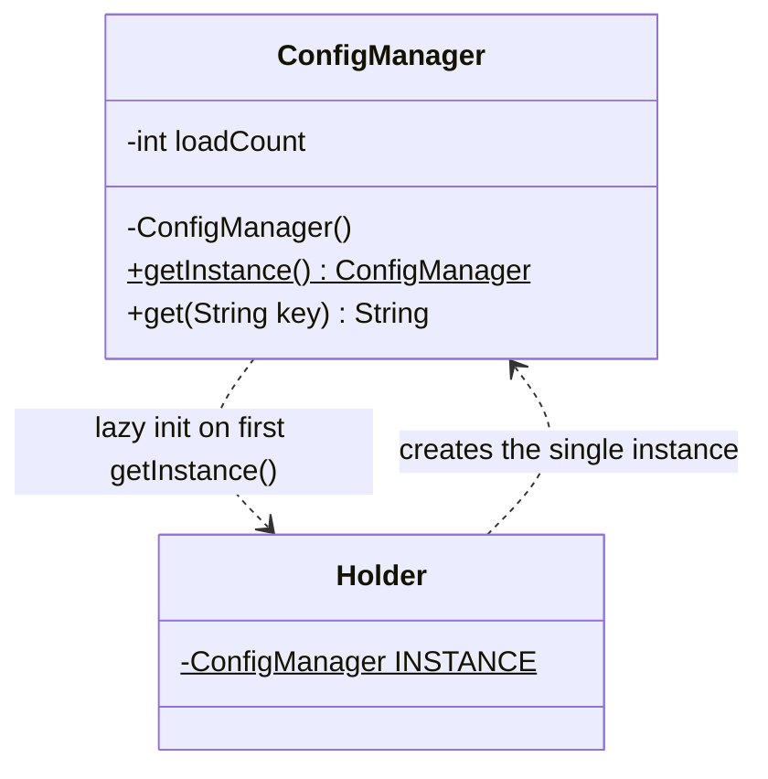
```mermaid
classDiagram
    class ConfigManager {
        -int loadCount
        -ConfigManager()
        +getInstance() ConfigManager$
        +get(String key) String
    }
    class Holder {
        -ConfigManager INSTANCE$
    }
    ConfigManager ..> Holder : lazy init on first getInstance()
    Holder ..> ConfigManager : creates the single instance
```

### Factory Method — `creational/FactoryMethodDemo.java`
A factory method decides which concrete `Notification` to instantiate; clients depend only on the interface.

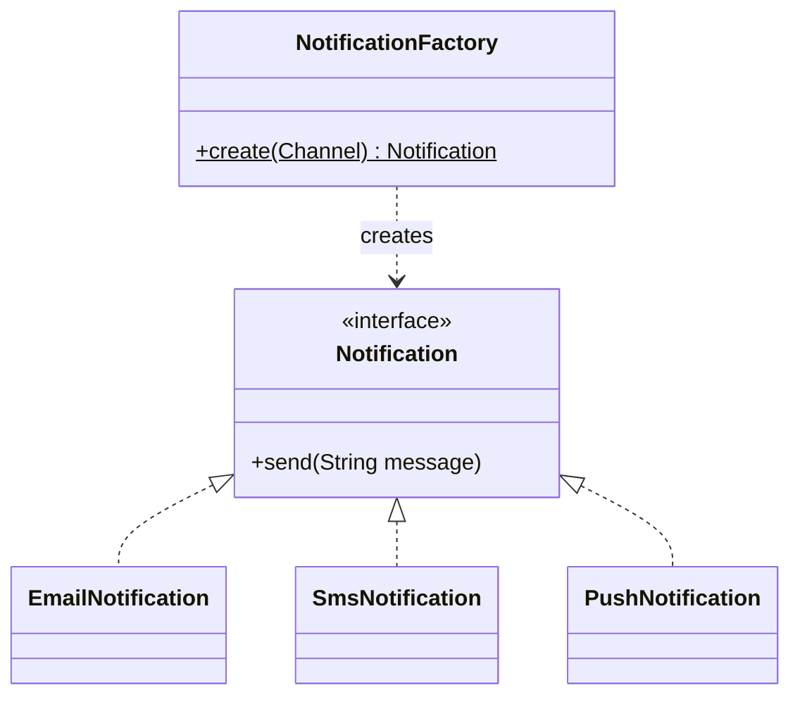
```mermaid
classDiagram
    class Notification {
        <<interface>>
        +send(String message)
    }
    class EmailNotification
    class SmsNotification
    class PushNotification
    class NotificationFactory {
        +create(Channel) Notification$
    }
    Notification <|.. EmailNotification
    Notification <|.. SmsNotification
    Notification <|.. PushNotification
    NotificationFactory ..> Notification : creates
```

### Abstract Factory — `creational/AbstractFactoryDemo.java`
Each factory produces a consistent *family* of products (all light, or all dark).

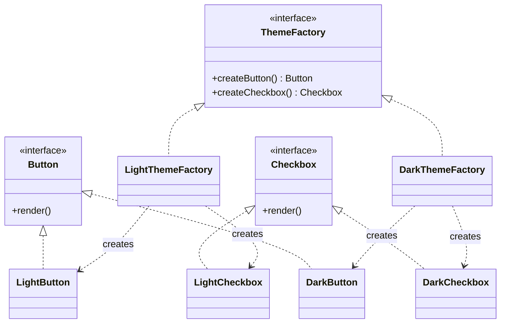
```mermaid
classDiagram
    class Button {
        <<interface>>
        +render()
    }
    class Checkbox {
        <<interface>>
        +render()
    }
    class ThemeFactory {
        <<interface>>
        +createButton() Button
        +createCheckbox() Checkbox
    }
    class LightThemeFactory
    class DarkThemeFactory
    Button <|.. LightButton
    Button <|.. DarkButton
    Checkbox <|.. LightCheckbox
    Checkbox <|.. DarkCheckbox
    ThemeFactory <|.. LightThemeFactory
    ThemeFactory <|.. DarkThemeFactory
    LightThemeFactory ..> LightButton : creates
    LightThemeFactory ..> LightCheckbox : creates
    DarkThemeFactory ..> DarkButton : creates
    DarkThemeFactory ..> DarkCheckbox : creates
```

### Builder — `creational/BuilderDemo.java`
A fluent nested `Builder` assembles an immutable `HttpRequest` step by step.

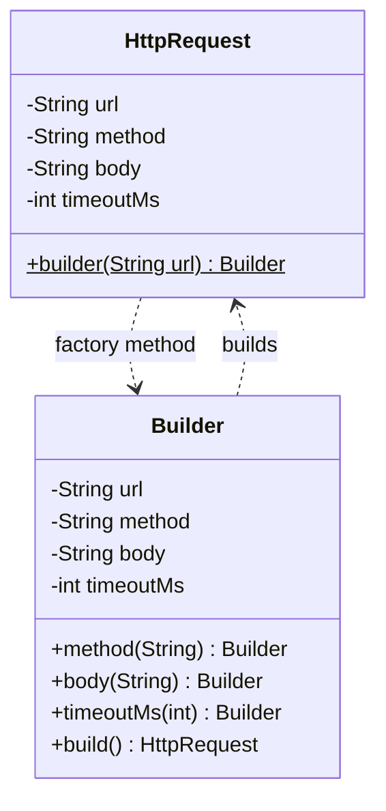
```mermaid
classDiagram
    class HttpRequest {
        -String url
        -String method
        -String body
        -int timeoutMs
        +builder(String url) Builder$
    }
    class Builder {
        -String url
        -String method
        -String body
        -int timeoutMs
        +method(String) Builder
        +body(String) Builder
        +timeoutMs(int) Builder
        +build() HttpRequest
    }
    HttpRequest ..> Builder : factory method
    Builder ..> HttpRequest : builds
```

### Prototype — `creational/PrototypeDemo.java`
New objects are produced by deep-cloning an existing instance.

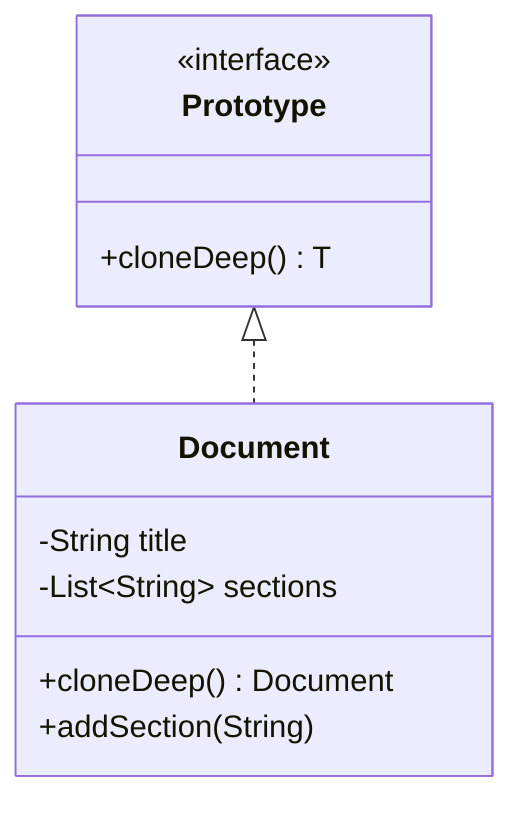
```mermaid
classDiagram
    class Prototype {
        <<interface>>
        +cloneDeep() T
    }
    class Document {
        -String title
        -List~String~ sections
        +cloneDeep() Document
        +addSection(String)
    }
    Prototype <|.. Document
```

---

## Structural

### Adapter — `structural/AdapterDemo.java`
`StripeAdapter` makes the incompatible `LegacyStripeApi` conform to the expected `PaymentProcessor`.

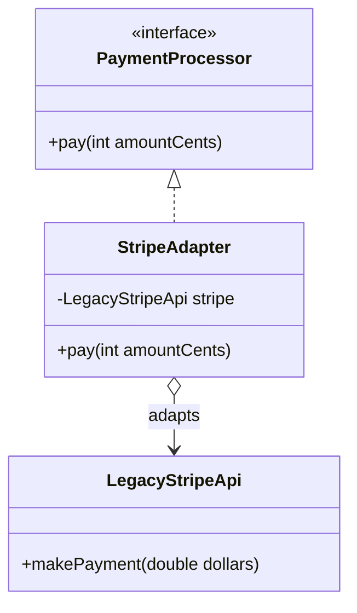
```mermaid
classDiagram
    class PaymentProcessor {
        <<interface>>
        +pay(int amountCents)
    }
    class LegacyStripeApi {
        +makePayment(double dollars)
    }
    class StripeAdapter {
        -LegacyStripeApi stripe
        +pay(int amountCents)
    }
    PaymentProcessor <|.. StripeAdapter
    StripeAdapter o--> LegacyStripeApi : adapts
```

### Decorator — `structural/DecoratorDemo.java`
Decorators implement `Coffee` *and* wrap a `Coffee`, stacking behavior at runtime.

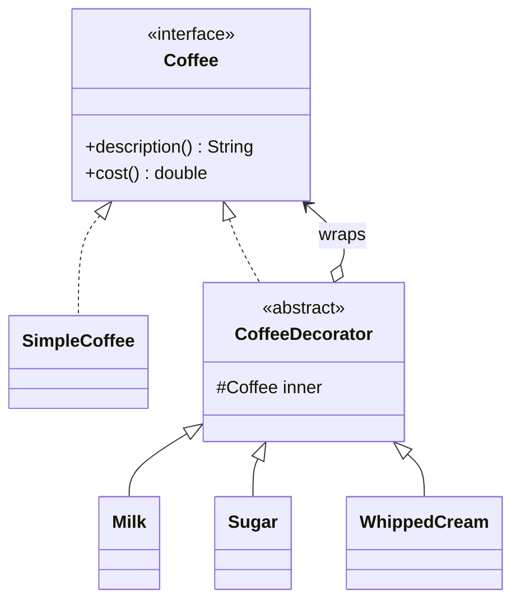
```mermaid
classDiagram
    class Coffee {
        <<interface>>
        +description() String
        +cost() double
    }
    class SimpleCoffee
    class CoffeeDecorator {
        <<abstract>>
        #Coffee inner
    }
    class Milk
    class Sugar
    class WhippedCream
    Coffee <|.. SimpleCoffee
    Coffee <|.. CoffeeDecorator
    CoffeeDecorator <|-- Milk
    CoffeeDecorator <|-- Sugar
    CoffeeDecorator <|-- WhippedCream
    CoffeeDecorator o--> Coffee : wraps
```

### Facade — `structural/FacadeDemo.java`
`OrderFacade` exposes one `placeOrder()` method over three subsystem services.

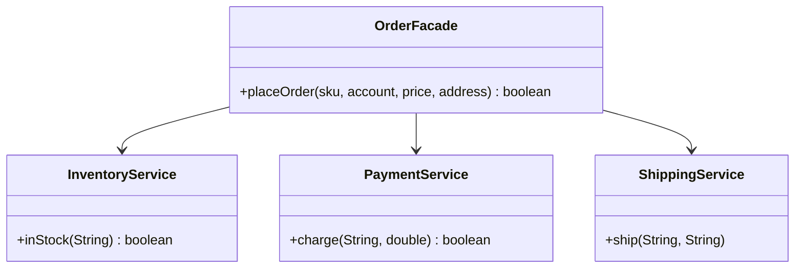
```mermaid
classDiagram
    class OrderFacade {
        +placeOrder(sku, account, price, address) boolean
    }
    class InventoryService {
        +inStock(String) boolean
    }
    class PaymentService {
        +charge(String, double) boolean
    }
    class ShippingService {
        +ship(String, String)
    }
    OrderFacade --> InventoryService
    OrderFacade --> PaymentService
    OrderFacade --> ShippingService
```

### Proxy — `structural/ProxyDemo.java`
`ImageProxy` shares `Image` and lazily creates the expensive `HighResImage` on first use.

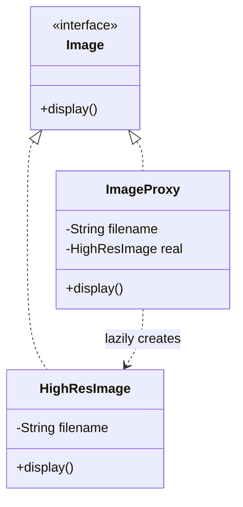
```mermaid
classDiagram
    class Image {
        <<interface>>
        +display()
    }
    class HighResImage {
        -String filename
        +display()
    }
    class ImageProxy {
        -String filename
        -HighResImage real
        +display()
    }
    Image <|.. HighResImage
    Image <|.. ImageProxy
    ImageProxy ..> HighResImage : lazily creates
```

### Composite — `structural/CompositeDemo.java`
Leaf (`FileNode`) and composite (`FolderNode`) share `FileSystemNode`; folders hold children.

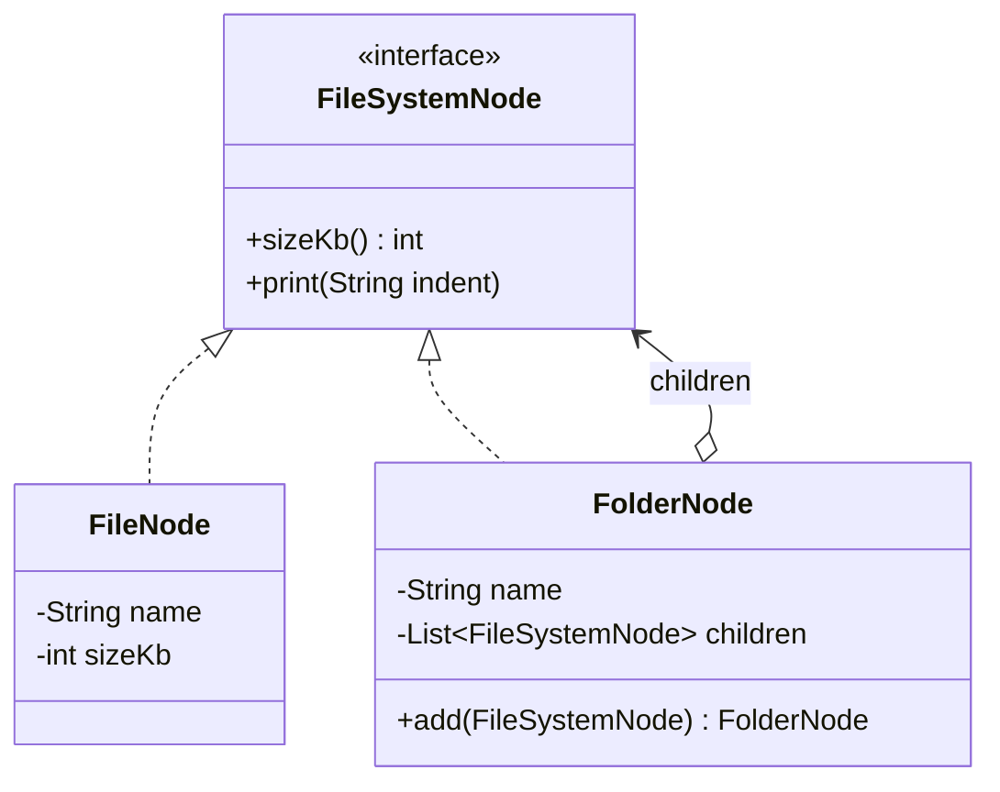
```mermaid
classDiagram
    class FileSystemNode {
        <<interface>>
        +sizeKb() int
        +print(String indent)
    }
    class FileNode {
        -String name
        -int sizeKb
    }
    class FolderNode {
        -String name
        -List~FileSystemNode~ children
        +add(FileSystemNode) FolderNode
    }
    FileSystemNode <|.. FileNode
    FileSystemNode <|.. FolderNode
    FolderNode o--> FileSystemNode : children
```

### Flyweight — `structural/FlyweightDemo.java`
`TreeFactory` caches shared `TreeType` flyweights (intrinsic state); position is passed in (extrinsic).

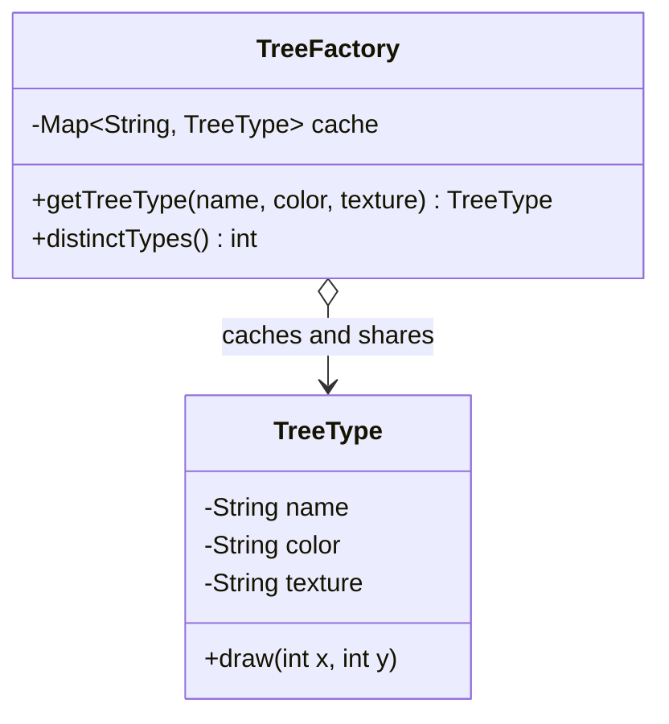
```mermaid
classDiagram
    class TreeType {
        -String name
        -String color
        -String texture
        +draw(int x, int y)
    }
    class TreeFactory {
        -Map~String, TreeType~ cache
        +getTreeType(name, color, texture) TreeType
        +distinctTypes() int
    }
    TreeFactory o--> TreeType : caches and shares
```

### Bridge — `structural/BridgeDemo.java`
The `Shape` abstraction holds a `Renderer` implementor; the two hierarchies vary independently.

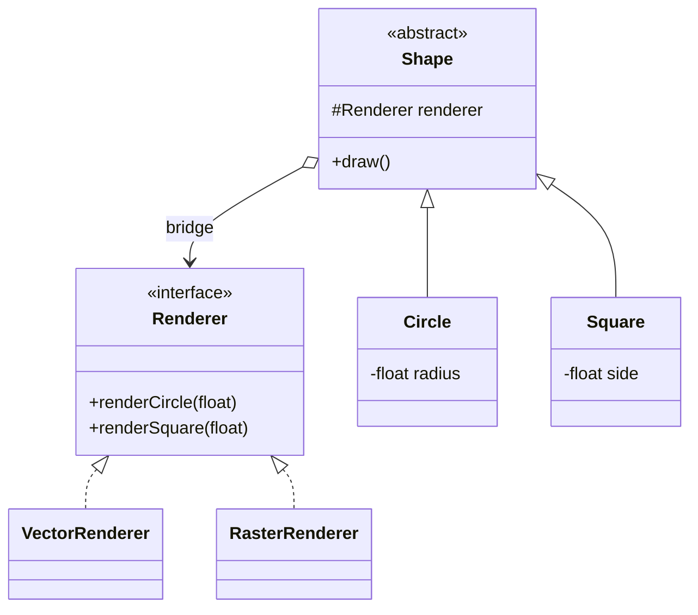
```mermaid
classDiagram
    class Renderer {
        <<interface>>
        +renderCircle(float)
        +renderSquare(float)
    }
    class VectorRenderer
    class RasterRenderer
    class Shape {
        <<abstract>>
        #Renderer renderer
        +draw()
    }
    class Circle {
        -float radius
    }
    class Square {
        -float side
    }
    Renderer <|.. VectorRenderer
    Renderer <|.. RasterRenderer
    Shape <|-- Circle
    Shape <|-- Square
    Shape o--> Renderer : bridge
```

---

## Behavioral

### Strategy — `behavioral/StrategyDemo.java`
The context holds an interchangeable `ShippingStrategy` (often a lambda).

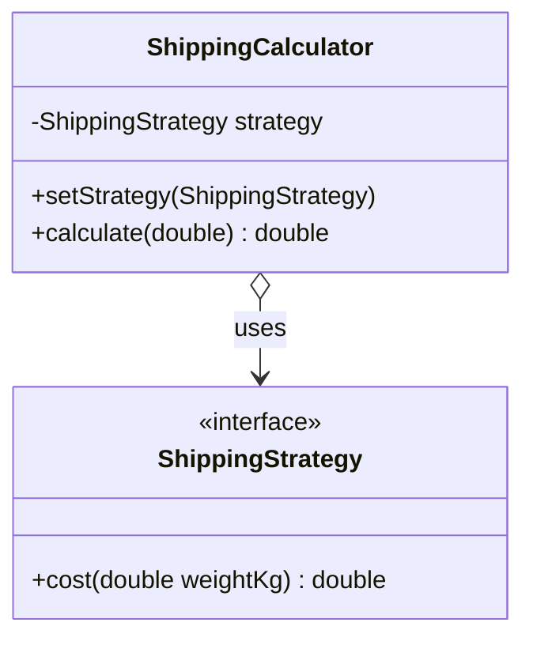
```mermaid
classDiagram
    class ShippingStrategy {
        <<interface>>
        +cost(double weightKg) double
    }
    class ShippingCalculator {
        -ShippingStrategy strategy
        +setStrategy(ShippingStrategy)
        +calculate(double) double
    }
    ShippingCalculator o--> ShippingStrategy : uses
```

### Observer — `behavioral/ObserverDemo.java`
`WeatherStation` notifies all subscribed `Observer`s on state change.

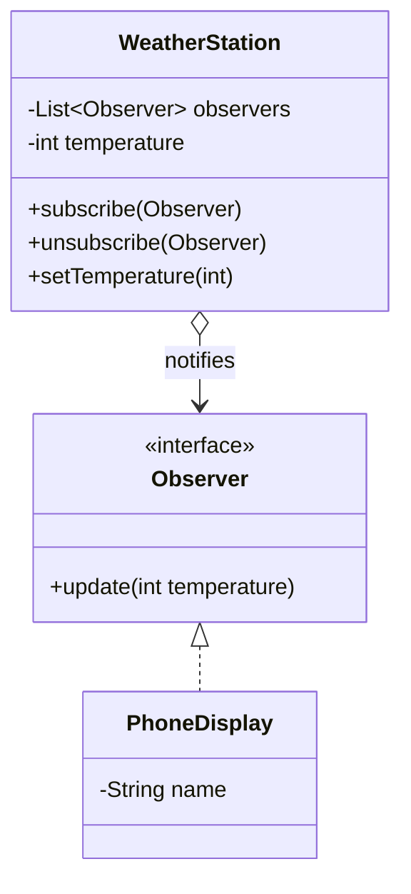
```mermaid
classDiagram
    class Observer {
        <<interface>>
        +update(int temperature)
    }
    class WeatherStation {
        -List~Observer~ observers
        -int temperature
        +subscribe(Observer)
        +unsubscribe(Observer)
        +setTemperature(int)
    }
    class PhoneDisplay {
        -String name
    }
    Observer <|.. PhoneDisplay
    WeatherStation o--> Observer : notifies
```

### Command — `behavioral/CommandDemo.java`
A `Command` encapsulates a request on a receiver; the invoker keeps history for undo.

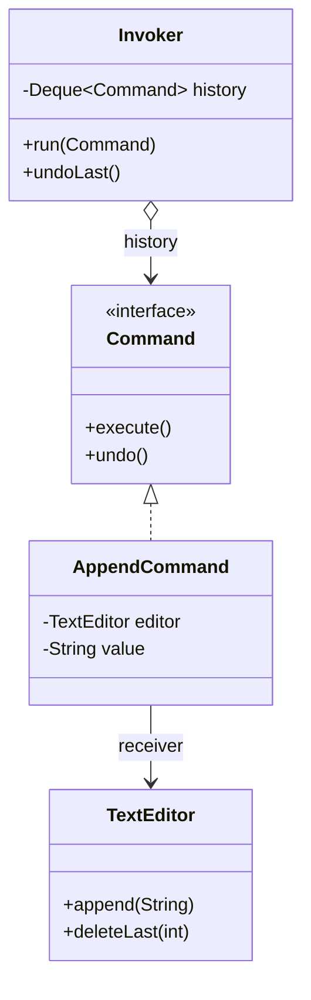
```mermaid
classDiagram
    class Command {
        <<interface>>
        +execute()
        +undo()
    }
    class AppendCommand {
        -TextEditor editor
        -String value
    }
    class TextEditor {
        +append(String)
        +deleteLast(int)
    }
    class Invoker {
        -Deque~Command~ history
        +run(Command)
        +undoLast()
    }
    Command <|.. AppendCommand
    AppendCommand --> TextEditor : receiver
    Invoker o--> Command : history
```

### Template Method — `behavioral/TemplateMethodDemo.java`
`export()` is the fixed algorithm; subclasses override the `format()` step.

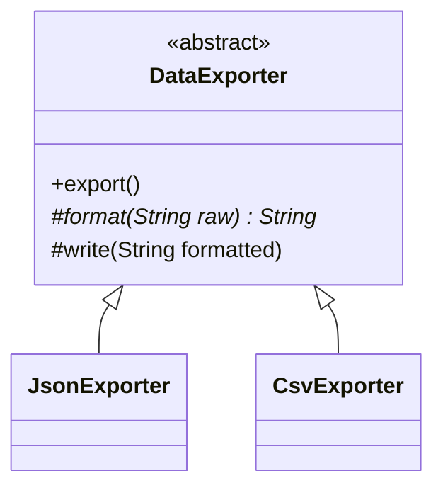
```mermaid
classDiagram
    class DataExporter {
        <<abstract>>
        +export()
        #format(String raw) String*
        #write(String formatted)
    }
    class JsonExporter
    class CsvExporter
    DataExporter <|-- JsonExporter
    DataExporter <|-- CsvExporter
```

### State — `behavioral/StateDemo.java`
The machine delegates to its current `State`, which can transition it to another state.

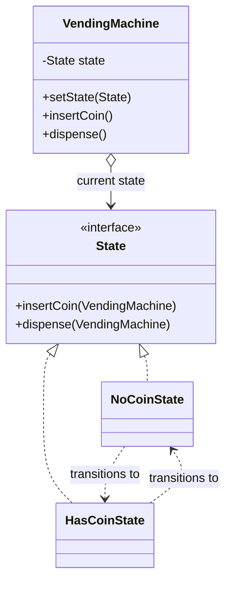
```mermaid
classDiagram
    class State {
        <<interface>>
        +insertCoin(VendingMachine)
        +dispense(VendingMachine)
    }
    class NoCoinState
    class HasCoinState
    class VendingMachine {
        -State state
        +setState(State)
        +insertCoin()
        +dispense()
    }
    State <|.. NoCoinState
    State <|.. HasCoinState
    VendingMachine o--> State : current state
    NoCoinState ..> HasCoinState : transitions to
    HasCoinState ..> NoCoinState : transitions to
```

### Chain of Responsibility — `behavioral/ChainOfResponsibilityDemo.java`
Each `Approver` handles or forwards the request to the next link.

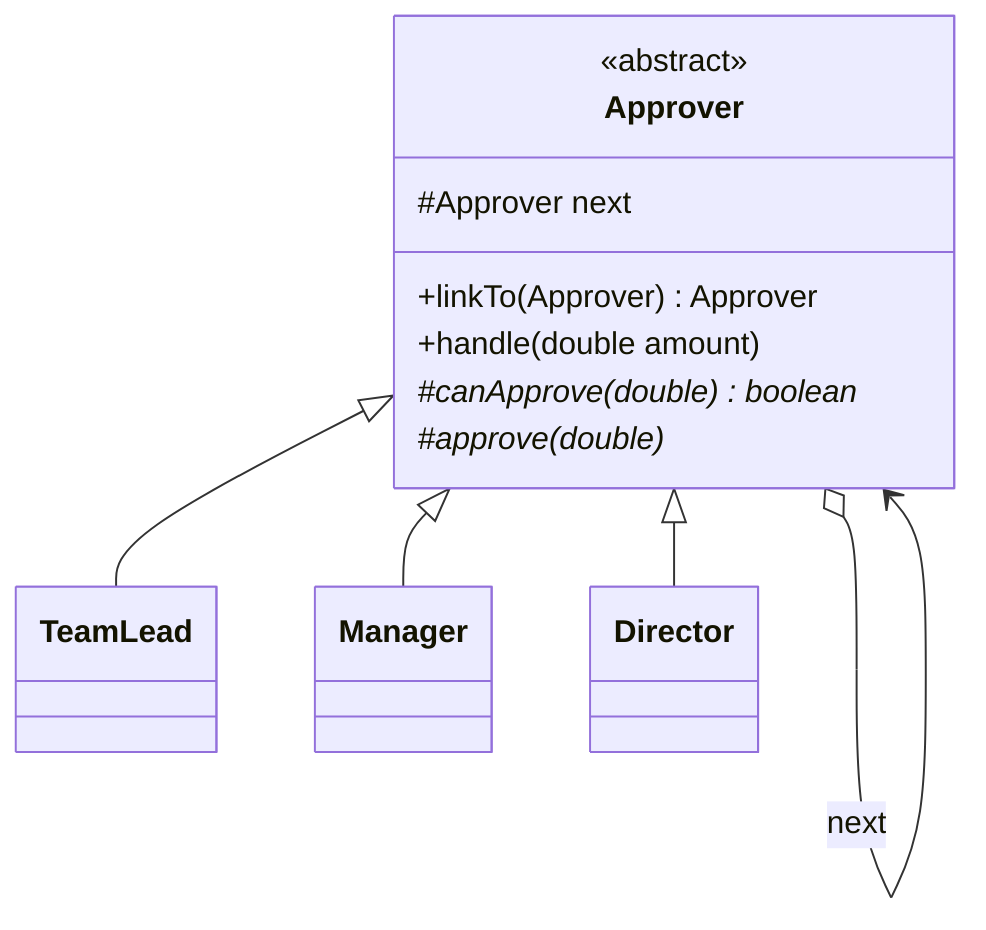
```mermaid
classDiagram
    class Approver {
        <<abstract>>
        #Approver next
        +linkTo(Approver) Approver
        +handle(double amount)
        #canApprove(double) boolean*
        #approve(double)*
    }
    class TeamLead
    class Manager
    class Director
    Approver <|-- TeamLead
    Approver <|-- Manager
    Approver <|-- Director
    Approver o--> Approver : next
```

### Iterator — `behavioral/IteratorDemo.java`
`RingBuffer` implements `Iterable`, returning an `Iterator` that hides the backing array.

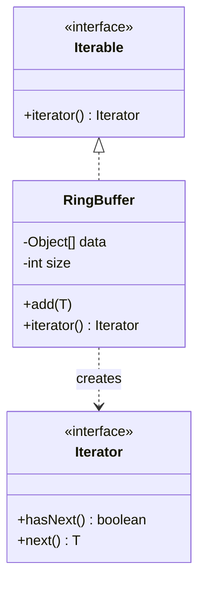
```mermaid
classDiagram
    class Iterable {
        <<interface>>
        +iterator() Iterator
    }
    class Iterator {
        <<interface>>
        +hasNext() boolean
        +next() T
    }
    class RingBuffer {
        -Object[] data
        -int size
        +add(T)
        +iterator() Iterator
    }
    Iterable <|.. RingBuffer
    RingBuffer ..> Iterator : creates
```

### Mediator — `behavioral/MediatorDemo.java`
`ChatRoom` centralizes communication so `User`s never reference each other directly.

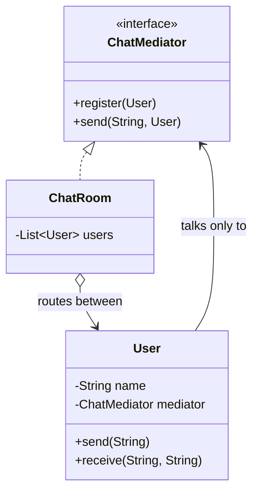
```mermaid
classDiagram
    class ChatMediator {
        <<interface>>
        +register(User)
        +send(String, User)
    }
    class ChatRoom {
        -List~User~ users
    }
    class User {
        -String name
        -ChatMediator mediator
        +send(String)
        +receive(String, String)
    }
    ChatMediator <|.. ChatRoom
    ChatRoom o--> User : routes between
    User --> ChatMediator : talks only to
```

### Memento — `behavioral/MementoDemo.java`
The originator saves/restores opaque `EditorMemento` snapshots held by a caretaker.

```mermaid
classDiagram
    class TextEditor {
        -String content
        +type(String)
        +save() EditorMemento
        +restore(EditorMemento)
    }
    class EditorMemento {
        -String content
    }
    class History {
        -Deque~EditorMemento~ stack
        +push(EditorMemento)
        +pop() EditorMemento
    }
    TextEditor ..> EditorMemento : creates and restores
    History o--> EditorMemento : stores (opaque)
```

### Visitor — `behavioral/VisitorDemo.java`
`Item.accept(Visitor)` does double dispatch; new operations = new visitors.

```mermaid
classDiagram
    class Item {
        <<interface>>
        +accept(Visitor) double
    }
    class Book {
        +price double
    }
    class Electronic {
        +price double
    }
    class Visitor {
        <<interface>>
        +visit(Book) double
        +visit(Electronic) double
    }
    class TaxVisitor
    class ShippingVisitor
    Item <|.. Book
    Item <|.. Electronic
    Visitor <|.. TaxVisitor
    Visitor <|.. ShippingVisitor
    Item ..> Visitor : accept (double dispatch)
```

### Interpreter — `behavioral/InterpreterDemo.java`
Each grammar rule is an `Expression`; the AST is a Composite of terminal/non-terminal nodes.

```mermaid
classDiagram
    class Expression {
        <<interface>>
        +interpret() int
    }
    class Number {
        -int value
    }
    class Add {
        -Expression left
        -Expression right
    }
    class Subtract {
        -Expression left
        -Expression right
    }
    Expression <|.. Number
    Expression <|.. Add
    Expression <|.. Subtract
    Add o--> Expression : left, right
    Subtract o--> Expression : left, right
```
